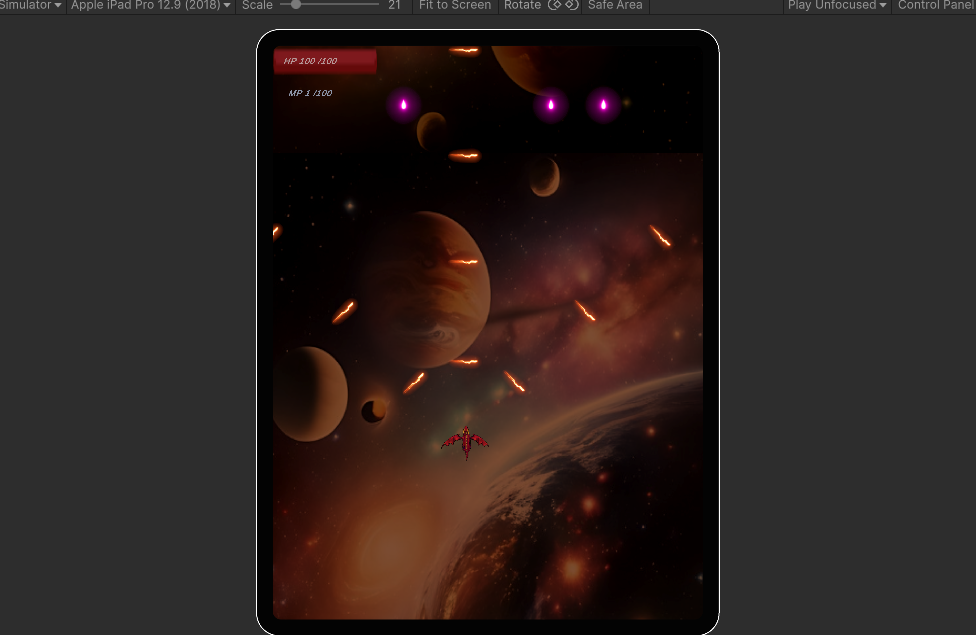
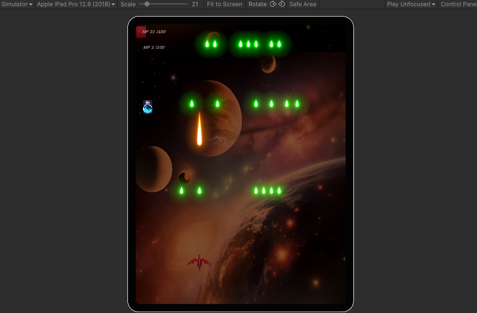

#  2D 슈팅 게임 - Dragon Flight

## 🌌 컨셉

**Dragon Flight**는 우주에서 살아남은 마지막 드래곤이  
끊임없이 떨어지는 불꽃 소행성들을 피해 싸우는 **라운드 기반 2D 슈팅 게임**입니다.  

플레이어는 점점 강해지는 적들과 불규칙한 소행성 속에서  
**특수공격, 마나 관리, 회피기동**을 통해 끝없는 라운드를 돌파하며  
**우주 최후의 생존자**가 되어야 합니다.

---

##  주요 시스템

### 전투 & 스킬

- **기본 공격:** 플레이어가 앞을 향해 발사하는 단일 화염탄
- **특수 공격:** 포션을 먹으면 **3방향 화염 스킬** 발동
  - 마나가 **즉시 100**으로 충전되고
  - **지속시간 동안 마나는 다시 0부터 시작**

---

###  라운드 구성

- 총 **8 라운드** + **9라운드 클리어 시 `YOU WIN!`**
- 각 라운드마다 등장하는 **소행성 종류가 다양**
  - 속도와 체력 모두 다른 여러 소행성 등장
- 라운드 종료 전 HP가 0이 되면 **`Game Over`** 발생
- **UI로 현재 라운드, 체력(HP), 마나(MP) 모두 실시간 표시**

---

###  플레이어 능력치

- **체력 100**
  - 소행성과 충돌 시 소행성의 각각의 피해량만큼 감소
- **마나**
  - 포션 획득 시 100이 되고, 특수공격 발동 후 0부터 다시 시작

---

### 기타 특징

- **우주 배경**으로 구성된 몽환적인 연출
- **카메라가 드래곤 움직임에 따라 자연스럽게 추적**
- **라운드마다 난이도 점증 설계**
- **TextMeshPro 기반 UI**
- 게임 흐름: `Start → Round1~8 → YOU WIN / Game Over`

---

## 사용 기술

- **Unity 2021.3.x**
- **C#**
- **TextMeshPro**
- **Unity Physics 2D**
- **Git & GitHub**

---

## 시연 이미지

> 📸 아래는 실제 플레이 장면입니다
**장면 1**

**장면 2**

  

**장면 3**

  

---

##  개발 포인트

- "단순한 슈팅을 넘어서, 회피 + 자원 관리 + 타이밍 판단까지 포함한 설계"
- "화려한 이펙트보다도 명확한 UI와 체계적인 라운드 흐름에 중점"
- "각 오브젝트의 Hitbox와 충돌 처리 디테일에 신경 씀"
- "드래곤의 애니메이션 및 특수 스킬 타이밍 제어 구현"

---

##  개발 의도

이 프로젝트는 단순한 학생 포트폴리오 수준을 넘어,  
**게임 메커니즘 설계, 반복 가능한 난이도 곡선, UI/UX, 플레이 몰입감**을  
모두 고려하여 개발되었습니다.

> “우주 속 드래곤이 외롭지 않게, 유저가 그 곁에서 싸우는 느낌을 주는 게임”  

---

##  실행 방법

1. Unity 2021.3.x 버전으로 열기  
2. `Scenes/Scene1.unity`부터 시작  
3. 플레이어 조작: 방향키 이동 / 스페이스바 공격  
4. 포션 획득 후 특수 공격 자동 발동  

---

